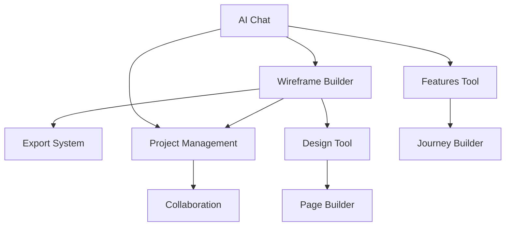

# Flexperts Platform - Feature Specifications

## 🎯 MVP Features (Phase 1)

### 1. AI Chat Interface
**Priority**: Critical  
**Status**: Not Started

#### Description
WhatsApp-style conversational interface where users describe their app ideas in natural language.

#### Key Features
- Real-time streaming responses
- Message persistence
- Typing indicators
- File attachments (images, documents)
- Voice input (future)
- Message reactions/feedback

#### Technical Requirements
- Anthropic Claude API integration
- WebSocket for real-time updates
- Message storage in Supabase
- Optimistic UI updates
- Error recovery

#### Success Metrics
- First message response < 2 seconds
- 95% message delivery rate
- User can start building in < 5 minutes

---

### 2. Visual Wireframe Builder
**Priority**: Critical  
**Status**: Not Started

#### Description
Point-and-click interface to visually design app layouts while chatting with AI.

#### Key Features
- Drag-and-drop components
- Real-time preview
- Responsive design tools
- Component library
- Undo/redo functionality
- Auto-save every 30 seconds

#### Technical Requirements
- Canvas-based rendering
- Touch gesture support
- State synchronization
- Export to HTML/React
- Accessibility compliance

#### Success Metrics
- Create first screen < 3 minutes
- 90% of users complete a wireframe
- Mobile performance score > 90

---

### 3. Export System
**Priority**: Critical  
**Status**: Not Started

#### Description
Generate comprehensive build plans that any AI or developer can follow.

#### Key Features
- Markdown export
- Component specifications
- User journey documentation
- Technical requirements
- Asset packaging
- Share via link

#### Technical Requirements
- Markdown generation
- File compression
- Unique share URLs
- Download tracking
- Version history

#### Success Metrics
- Export time < 10 seconds
- 100% fidelity to design
- Shareable link works 100%

---

## 🚀 Phase 2 Features

### 4. Project Management
**Priority**: High  
**Status**: Not Started

#### Features
- Project dashboard
- Version control
- Collaboration tools
- Progress tracking
- Template library

---

### 5. Design Tool
**Priority**: High  
**Status**: Not Started

#### Features
- Advanced styling options
- Theme customization
- Brand kit management
- Asset library
- Style guide generation

---

### 6. Features Tool
**Priority**: Medium  
**Status**: Not Started

#### Features
- Feature planning
- User story mapping
- Priority matrix
- Dependency tracking
- Progress visualization

---

### 7. Journey Builder
**Priority**: Medium  
**Status**: Not Started

#### Features
- Visual flow editor
- User persona creation
- Path analysis
- Interaction design
- Testing scenarios

---

### 8. Page Builder
**Priority**: Medium  
**Status**: Not Started

#### Features
- Advanced layouts
- SEO optimization
- Performance tools
- A/B testing
- Analytics integration

---

## 🌟 Phase 3 Features (Ecosystem)

### 9. Flexpert System
**Priority**: Medium  
**Status**: Planning

#### Features
- Expert profiles
- Skill matching
- Project marketplace
- Time tracking
- Payment processing
- Reviews/ratings

---

### 10. Flexfluencer Network
**Priority**: Low  
**Status**: Planning

#### Features
- Influencer profiles
- Campaign management
- Content calendar
- Analytics dashboard
- ROI tracking

---

### 11. Component Marketplace
**Priority**: Low  
**Status**: Planning

#### Features
- Buy/sell components
- Template store
- License management
- Revenue sharing
- Quality assurance

---

## 📊 Feature Comparison Matrix

| Feature | Free Trial | Starter | Pro | Enterprise |
|---------|------------|---------|-----|------------|
| AI Chat | ✅ Limited | ✅ | ✅ | ✅ |
| Wireframes | ✅ 3 projects | ✅ 10 | ✅ Unlimited | ✅ |
| Export | ❌ | ✅ | ✅ | ✅ |
| Collaboration | ❌ | ❌ | ✅ | ✅ |
| Flexpert Access | ❌ | ✅ Limited | ✅ | ✅ |
| Custom Branding | ❌ | ❌ | ✅ | ✅ |
| API Access | ❌ | ❌ | ❌ | ✅ |

## 🔄 Feature Dependencies

## 📈 Success Criteria

### User Engagement
- Daily active users > 1000
- Average session > 15 minutes
- Projects per user > 3
- Completion rate > 60%

### Technical Performance
- Page load < 3 seconds
- API response < 500ms
- 99.9% uptime
- Zero data loss

### Business Metrics
- Trial to paid > 20%
- Monthly churn < 5%
- NPS score > 50
- Support tickets < 2%

---

*Features prioritized based on user research and MVP requirements. Subject to iteration based on user feedback.*